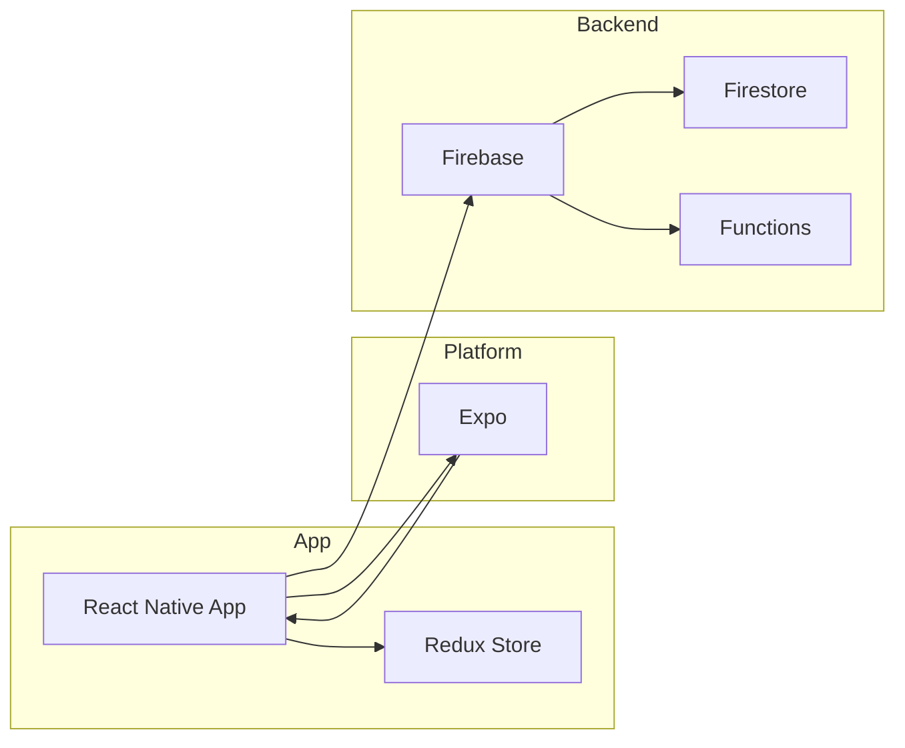
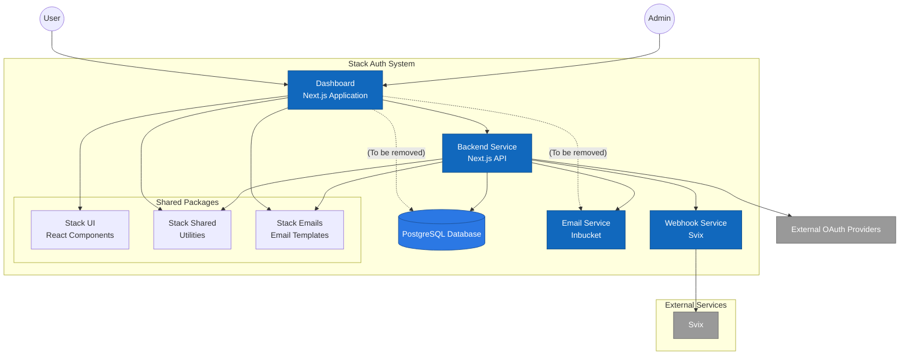

# 👩🏾‍💻 Ambiguity in Art

The FINN Lab at Dartmouth enlisted the team to build an app where people interpret different pieces of artwork in the HOOD Museum and see how similar/different the responses are through vectorizing responses and generating embeddings.

## Designs

[TODO: Add link to the project Figma]

[TODO: Add 2-4 screenshots from the app]

## Architecture

### Tech Stack 🥞

The app is built using:

- React Native
- Redux
- Expo
- Firebase

### Style

- Follows a modular file structure, separating components, reducers, and utility functions into their respective directories.
- Utilizes hooks like `useState` and `useSelector` for state management.
- Integrates with Firebase, specifically Firestore, for data storage and retrieval.
- Uses Expo Router for navigation between screens.

### Data Models

The app utilizes Firestore to manage data. The main data models in the app include:

- Session: Represents a user session in the app, containing information such as the session ID, user consent, and email.
- Response: Represents a user's response to a painting. It includes the response ID, painting ID, user's interpretations, ratings, and other metadata associated with the response.
- Painting: Represents a painting in the app. It contains details such as the painting ID, title, artist, and image URL.

The data is organized into collections and documents in Firestore, with each document having its own set of fields. The relationships between the data models are established through the use of document references.

### File Structure

- `assets/`: Contains app assets such as images
- `src/`: Main source code directory
- `app/`: Contains the main app components and screens
- `components/`: Contains reusable components used throughout the app
- `reducers/`: Contains Redux reducers
- `utils/`: Contains utility functions and constants

For more detailed documentation on our file structure and specific functions in the code, feel free to check the project files themselves.

## Setup Steps

1. Clone repo by running `git clone https://github.com/dali-lab/ambiguity-in-art-frontend.git` in your terminal and `cd ambiguity-in-art-frontend`

2. Run `npm install` to install all of the necessary packages

- If you don't have npm installed, you can install it by following the instructions [here](https://docs.npmjs.com/downloading-and-installing-node-js-and-npm)

3. To start the app locally, run `npm start`.

## Deployment 🚀

The app is deployed using Expo.

Access to the deployed project can be obtained by contacting the project maintainers.

## Authors

- **Ashna Kumar**, PM, Dartmouth '24
- **Brian Chiang**, Dev, Dartmouth '25
- **Rachel Pontes**, Dev, Dartmouth '26
- **Thomas Fenaroli**, Dev mentor, Dartmouth '24

## Acknowledgments 🤝

We would like to thank the FINN Lab at Dartmouth for enlisting us to build this app and for their guidance throughout the project.

---

Designed and developed by [@DALI Lab](https://github.com/dali-lab)
